# SecretaryHQ — Architecture Diagrams

Companion to `ARCHITECTURE.md`. Every diagram is a Mermaid block — renders natively on GitHub and on claude.ai (paste into chat, or upload this file and ask for an artifact).

**Last synced to architecture doc:** 2026-09-18 (filesystem-verified: migration count, PK names/columns in the ER diagram, call-end path, nav tabs, RLS role)

## Contents

1. [Deployment Topology](#1-deployment-topology)
2. [Data Model (ER)](#2-data-model-er)
3. [Voice Call Flow — Current (LiveKit Agent)](#3-voice-call-flow--current-livekit-agent)
4. [Voice Call Flow — Historical (pre-661d21d, Vapi + Edge Function)](#4-voice-call-flow--historical-pre-661d21d-vapi--edge-function)
5. [Booking — 7-Layer Atomic Check](#5-booking--7-layer-atomic-check)
6. [OAuth Flow (Generic, Calendar Providers)](#6-oauth-flow-generic-calendar-providers)
7. [Calendar + Square CRM Sync Fan-out](#7-calendar--square-crm-sync-fan-out)
8. [Auth Flow (JWT + Refresh + Force-logout)](#8-auth-flow-jwt--refresh--force-logout)
9. [Billing State Machine](#9-billing-state-machine)
10. [Dashboard Component Hierarchy](#10-dashboard-component-hierarchy)
11. [RLS Context Flow (withTenantClient)](#11-rls-context-flow-withtenantclient)
12. [Call Sequencing — Question Trees (the LIVE call architecture)](#12-call-sequencing--question-trees-the-live-call-architecture)

---

## 1. Deployment Topology

Physical layout post-LiveKit migration (`661d21d`, 2026-04-27).

```mermaid
flowchart TB
  Caller([Caller phone])
  Telnyx["Telnyx SIP Trunk<br/>+1 630 822 9086 (live)"]
  Caller -->|PSTN| Telnyx

  LiveKit["LiveKit Cloud<br/>SIP bridge + rooms<br/>dispatch rule SDR_WEL49AwBB4NW"]
  Telnyx -->|SIP via livekit-outbound| LiveKit

  subgraph agentBox["Agent Worker — Railway: secretary-hq-agent"]
    direction TB
    Agent["Node + LiveKit Agents SDK<br/>worker AW_vPmGExrgTeGn"]
    DG["Deepgram Nova-3 STT"]
    OAI["OpenAI GPT-4.1-mini LLM"]
    TTS["Deepgram Aura TTS<br/>(streaming; per-tenant via tenants.tts_voice)"]
    Agent --> DG
    Agent --> OAI
    Agent --> TTS
  end

  LiveKit -->|WebSocket| Agent

  Fastify["Fastify Backend<br/>29 route modules + agentTools dir<br/>secretary-hq-production.up.railway.app<br/>(Railway + Nixpacks, Node 22)"]
  Agent -->|POST /agent-tools/* + x-agent-secret| Fastify

  Postgres[("Postgres + pgvector<br/>Supabase us-west-2<br/>206 migrations")]
  Stripe["Stripe"]
  Integrations["Google / Outlook calendars<br/>+ Square CRM"]
  Dashboard["Next.js 16 Dashboard<br/>dashboard-production-cee3.up.railway.app"]

  Fastify --> Postgres
  Fastify --> Stripe
  Fastify --> Integrations
  Dashboard -->|Api.* calls| Fastify

  style agentBox fill:#1a2a1a,stroke:#484
```

---

## 2. Data Model (ER)

The core tenant-scoped tables and relationships (the full schema has grown to ~40 RLS-enabled tables — see `supabase/baseline.sql`; PKs follow the `<table_singular>_id` convention). `business_templates`, `audit_log`, `record_versions`, `voice_sessions`, `consent_records`, `opt_out_records` are global/platform-scoped and omitted here for clarity. `tenant_integration_settings` (Square OAuth tokens) and `entity_sync_map` (Square local↔external ID mapping) are actively written by the live Square CRM sync — the only external CRM surviving the 2026-06-12 removal of Jobber/HubSpot/ServiceTitan/GoHighLevel. Calendar sync uses `appointment_sync_map`.

```mermaid
erDiagram
  tenants ||--o{ users : "has"
  tenants ||--o{ customers : "owns"
  tenants ||--o{ employees : "employs"
  tenants ||--o{ resources : "owns"
  tenants ||--o{ services : "offers"
  tenants ||--o{ appointments : "books"
  tenants ||--o{ tenant_skills : "defines"
  tenants ||--o{ tenant_docs : "knows"
  tenants ||--o{ call_transcripts : "records"
  tenants ||--o{ call_summaries : "summarizes"
  tenants ||--o{ tenant_integration_settings : "configures"
  tenants ||--o{ tenant_calendar_settings : "configures"
  tenants ||--o{ reminder_schedules : "schedules"
  tenants ||--o{ unanswered_questions : "logs"

  employees ||--o{ employee_schedule : "scheduled"
  employees ||--o{ service_employee : "qualified for"
  services ||--o{ service_employee : "performed by"
  services ||--o{ service_resource : "needs resource"
  resources ||--o{ service_resource : "capable of"

  customers ||--o{ appointments : "books"
  employees ||--o{ appointments : "assigned"
  resources ||--o{ appointments : "occupies"
  services ||--o{ appointments : "for"

  call_transcripts ||--o| call_summaries : "summarized as"
  appointments ||--o{ appointment_sync_map : "external id"
  customers ||--o{ entity_sync_map : "external id"

  tenants {
    uuid tenant_id PK
    text name
    text inbound_phone
    text subscription_status
    text subscription_plan
    text timezone
    int sort_order
  }
  users {
    uuid user_id PK
    uuid tenant_id FK
    text email "unique per (tenant_id, email)"
    text password_hash
  }
  customers {
    uuid customer_id PK
    uuid tenant_id FK
    text phone "E.164"
    text name
    bool is_deleted
  }
  employees {
    uuid employee_id PK
    uuid tenant_id FK
    text name
    text first_name
    text last_name
    bool is_deleted
  }
  employee_schedule {
    uuid tenant_id PK
    uuid employee_id PK
    date shift_date PK
    time start_time
    time end_time "may be cross-midnight"
    bool is_off
  }
  resources {
    uuid resource_id PK
    uuid tenant_id FK
    text name
    bool is_deleted
  }
  services {
    uuid service_id PK
    uuid tenant_id FK
    text name
    int duration_minutes
    numeric price
    bool is_deleted
  }
  appointments {
    uuid appointment_id PK
    uuid tenant_id FK
    timestamptz start_time
    timestamptz end_time
    uuid customer_id FK
    uuid employee_id FK
    uuid resource_id FK
    uuid service_id FK
    text status
    text call_id
  }
  tenant_docs {
    uuid tenant_doc_id PK
    uuid tenant_id FK
    text title
    text source
    text content
    text normalized_text
    vector embedding "dim 1536"
  }
  call_transcripts {
    uuid call_transcript_id PK
    uuid tenant_id FK
    text call_id
    text raw_text
  }
  call_summaries {
    uuid call_summary_id PK
    uuid tenant_id FK
    text call_id
    text summary
    vector embedding
  }
  tenant_integration_settings {
    uuid tenant_id PK
    text provider PK "square only"
    text access_token
    text refresh_token
    timestamptz token_expires_at
    bool is_active
  }
  entity_sync_map {
    uuid entity_sync_map_id PK
    uuid tenant_id FK
    text entity_type
    uuid local_id
    text provider
    text external_id
    timestamptz remote_updated_at
  }
  service_employee {
    uuid tenant_id FK
    uuid service_id FK
    uuid employee_id FK
  }
  service_resource {
    uuid service_id FK
    uuid resource_id FK
  }
```

---

## 3. Voice Call Flow — Current (LiveKit Agent)

Post-migration (`661d21d`, 2026-04-27). Tool calls hit Fastify `/agent-tools/*` directly. Current voice stack: Telnyx → LiveKit Cloud → Deepgram Nova-3 STT → OpenAI GPT-4.1-mini → Deepgram Aura TTS. Live call sequencing is question trees (see `QUESTION_TREE_ARCHITECTURE.md`).

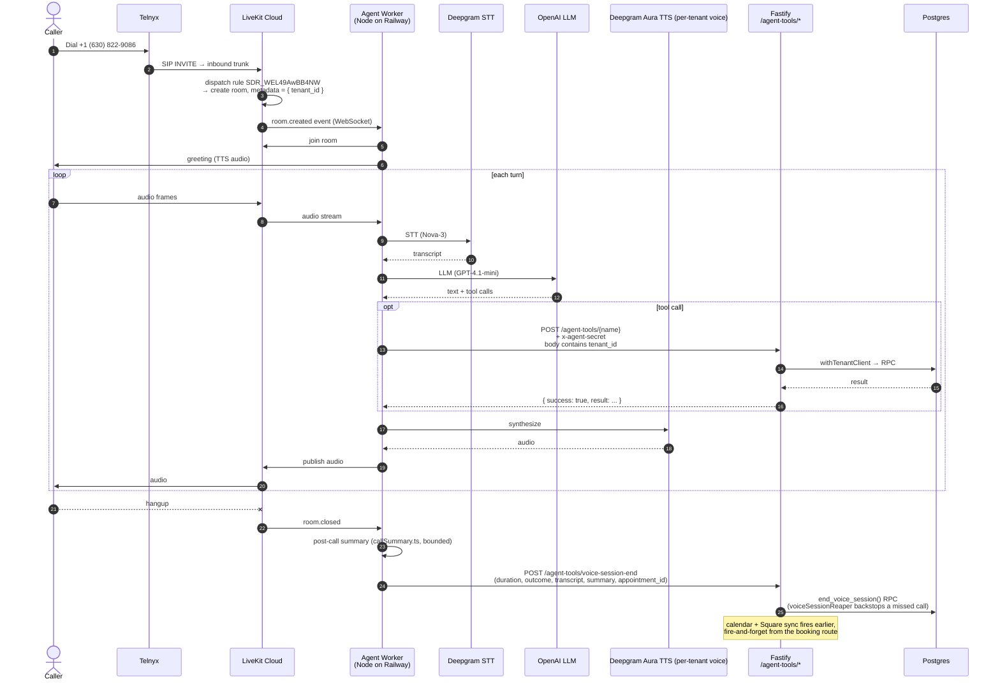

---

## 4. Voice Call Flow — Historical (pre-`661d21d`, Vapi + Edge Function)

> **Retired 2026-04-27.** The Vapi orchestration and `supabase/functions/vapi-tools/` Deno edge function were both deleted in commit `661d21d`. Section retained as a reference for anyone debugging old call recordings or transcript schemas.

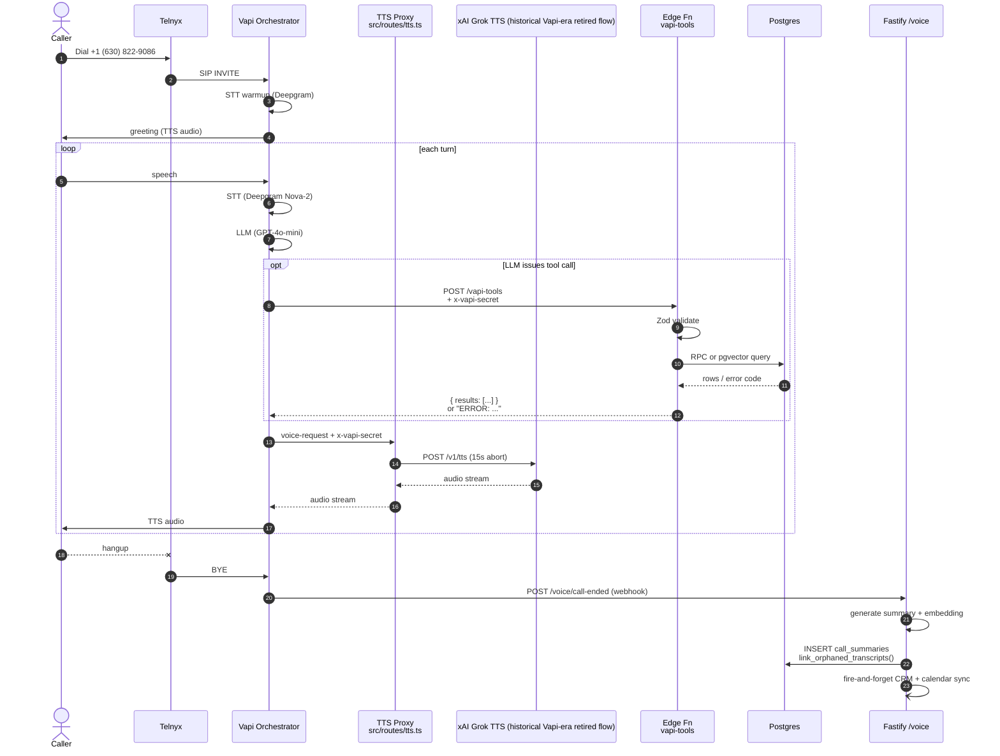

---

## 5. Booking — 7-Layer Atomic Check

`book_with_scheduling_atomic()` runs every check inside one transaction. Each specific failure returns a distinct error code (BUG-064) so the LLM can phrase it naturally to the caller.

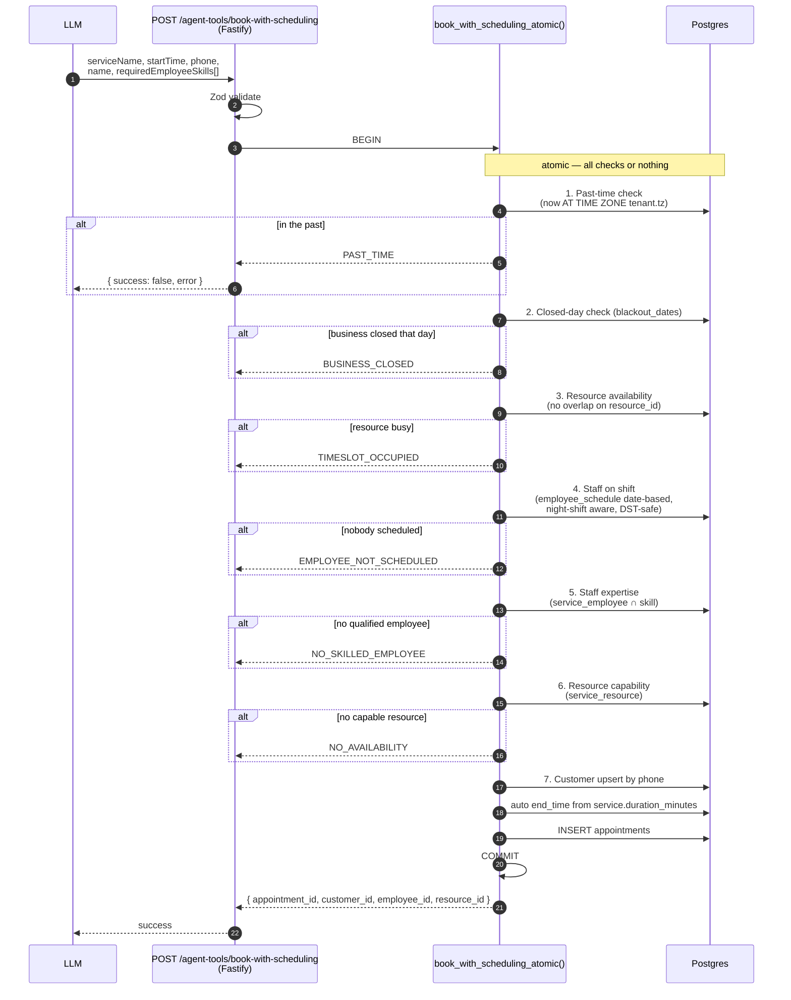

---

## 6. OAuth Flow (Generic, Calendar Providers)

One factory (`oauthCallbackFactory.ts`) + one token refresher (`tokenManagement.ts`) back both calendar integrations: Google Calendar and Outlook. (The competitor-CRM OAuth flows — Jobber, HubSpot, ServiceTitan, GoHighLevel — were removed 2026-06-12.) **Square** — the surviving external CRM sync — uses its own OAuth path in `src/services/crm/squareClient.ts` (`getAuthUrl` / `verifyState` / `exchangeCodeForTokens`) plus webhook HMAC-SHA256 verification (`SQUARE_WEBHOOK_SIGNATURE_KEY`) at `POST /square/webhook`, not the generic calendar factory; its tokens still land in `tenant_integration_settings`.

```mermaid
sequenceDiagram
  autonumber
  actor Owner as Owner (dashboard)
  participant API as Fastify<br/>/{provider}/auth/*
  participant Factory as oauthCallbackFactory
  participant Provider as Provider<br/>(Google/Outlook)
  participant DB as tenant_integration_settings
  participant Token as tokenManagement.ts

  rect rgb(40, 50, 70)
    Note over Owner,DB: Initial connect
    Owner->>API: GET /{provider}/auth/start
    API->>Factory: sign state JWT<br/>(tenant_id, csrf_nonce)
    Factory-->>Owner: 302 to provider authorize URL
    Owner->>Provider: authorize (browser)
    Provider-->>Owner: 302 to callback<br/>?code=...&state=...
    Owner->>API: GET /{provider}/auth/callback
    API->>Factory: verify state JWT (CSRF)
    Factory->>Provider: exchange code<br/>for access+refresh tokens
    Provider-->>Factory: tokens + expires_in
    Factory->>DB: upsert tokens (RLS-scoped)
    Factory-->>Owner: 302 to dashboard
  end

  rect rgb(40, 60, 45)
    Note over API,Token: Later — any call that needs a token
    API->>Token: getValidToken(tenantId, provider)
    Token->>DB: SELECT tokens
    alt expires_at - now < 5min
      Token->>Provider: POST /oauth/token<br/>(refresh_token grant)
      alt refresh ok
        Provider-->>Token: fresh tokens
        Token->>DB: UPDATE tokens
      else refresh fails
        Token->>DB: UPDATE is_active = false
        Token-->>API: throw<br/>(dashboard shows "Reconnect required")
      end
    end
    Token-->>API: access_token
  end
```

---

## 7. Calendar + Square CRM Sync Fan-out

The 4 appointment mutation points fan out through `syncOrchestrator.ts` to 2 calendar providers (push-only) **and** Square (the surviving external CRM sync, bidirectional). Each provider fails independently — one bad provider never blocks another. (The competitor-CRM providers — Jobber/HubSpot/ServiceTitan/GoHighLevel — were removed 2026-06-12; **Square remains live**.)

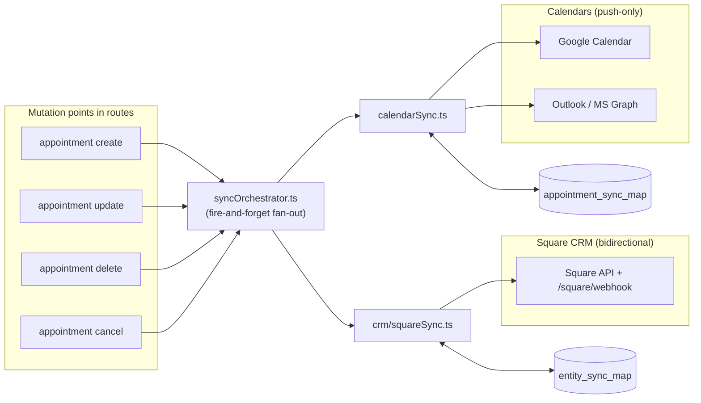

---

## 8. Auth Flow (JWT + Refresh + Force-logout)

8-hour JWT, client-side pre-emptive refresh 10 min before expiry, force-logout on `TENANT_NOT_FOUND`.

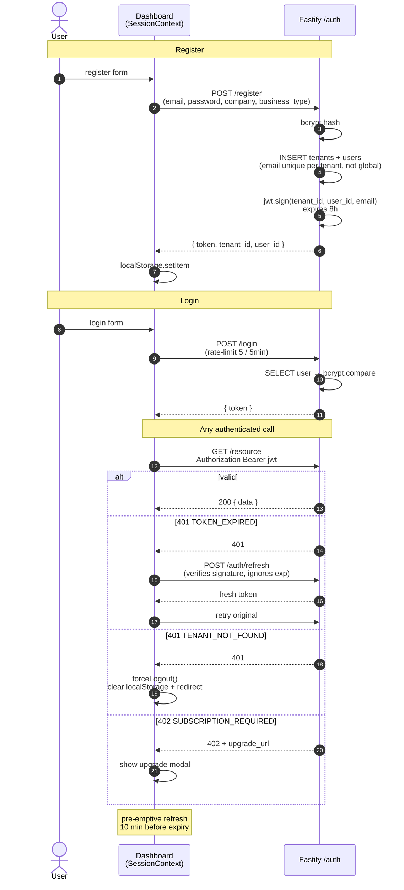

---

## 9. Billing State Machine

Intended Stripe flow in code. The route handles three webhook events once wired, but **no Stripe webhook endpoint is registered yet**, and final public pricing is still provisional. `subscriptionGateMiddleware` returns 402 on tenant-scoped routes whenever `subscription_status` is outside `{active, trialing}`.

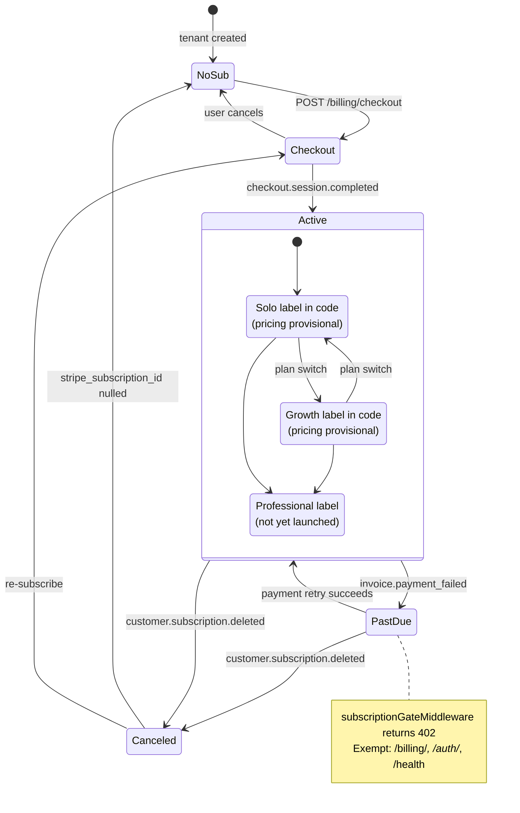

---

## 10. Dashboard Component Hierarchy

Provider tree + single primary tab bar (Primary tabs always visible, Advanced tabs gated to owners + admins). UI primitives under `components/ui/` are consumed throughout.

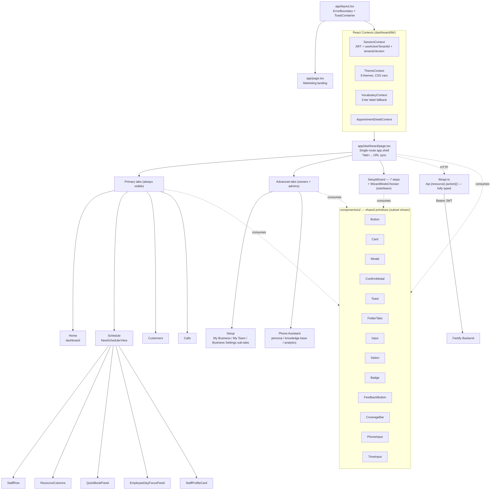

---

## 11. RLS Context Flow (withTenantClient)

Shows how per-request tenant isolation is enforced on a single shared `DATABASE_URL` pool, and why production must connect as the non-bypass role `app_user` (not a superuser) for the policies to bind.

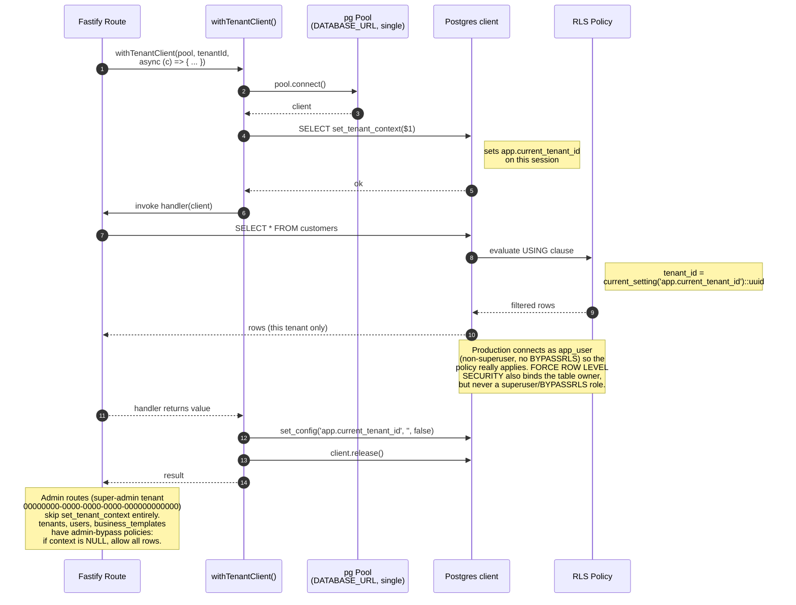

---

## 12. Call Sequencing — Question Trees (the LIVE call architecture)

Diagram 3 shows the MEDIA pipeline (audio in, audio out). This shows how the
conversation is SEQUENCED — which is a separate thing, chosen by flag in
`agent/src/index.ts`, and the part most likely to be misread from older docs.

Production runs `ChecklistAgent` (`ENABLE_QUESTION_TREE`, on unless set to `"false"`).
The prompt ladder (`tenants.system_prompt`) and the TaskGroup rungs are fallbacks and
are **not** what a live call executes.

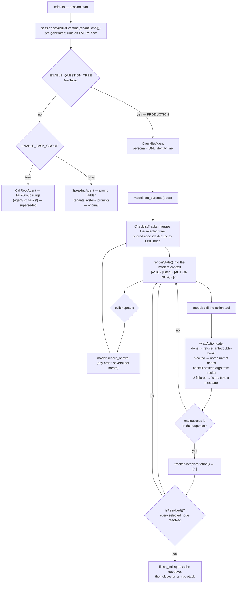

**The load-bearing ideas**

| Idea | Where | Why |
|---|---|---|
| Questions are DATA, not prose | `checklist/trees.ts` | 10 hand-written trees + 30 vertical intake trees; a call's checklist is the MERGE of the trees its purpose selects, and the tenant's PRESET decides which trees are selectable at all |
| Host code owns state | `checklist/tracker.ts` | the model is never trusted to remember what is done |
| Actions complete on a real id | `wrapAction` | "booked" cannot be said into existence |
| The goodbye gate | `tracker.isResolved()` | replaced book-first sequencing — a stated goal can't be forgotten because the call can't END on it |
| Tools follow the selection | `selectedTools()` | 26 defined, 12 offered; `updateTools` deferred to a macrotask, never inside a tool's own `execute` |
